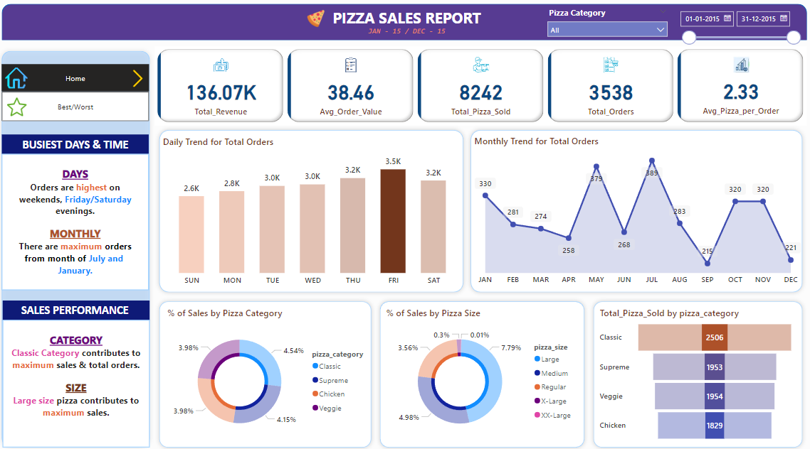
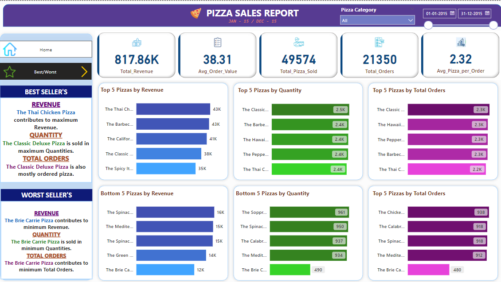

# Pizza Sales Analysis

## Project Overview
This project presents an in-depth analysis of pizza sales data, aiming to uncover key trends, sales performance metrics, and customer preferences. The analysis includes various key performance indicators (KPIs), sales trends by time, and a breakdown of sales by pizza category and size. The project is supplemented with visualizations created in Power BI and detailed SQL queries to support the findings.

## Data Source
The dataset used in this project includes sales transactions from a pizzeria, detailing order dates, pizza types, quantities sold, total revenue, and customer purchasing patterns. The analysis spans the period from January 1, 2015, to December 31, 2015.

## Tools & Technologies
- **Power BI**: Used to create an interactive dashboard showcasing key insights and trends.
- **SQL**: Used for data extraction and analysis to derive meaningful insights.
- **CSV**: The raw data file format used for analysis.
- **Microsoft Word & PDF**: Reports documenting the analysis process and results.

## Repository Structure
Pizza-Sales-Analysis/  
├── data/  
│   └── pizza_sales.csv               &nbsp;&nbsp;&nbsp;&nbsp;  # Raw data file  
├── reports/  
│   ├── SQL_queries_REPORT.docx       &nbsp;&nbsp;&nbsp;&nbsp;  # Detailed analysis report  
│   └── SQL_queries.pdf               &nbsp;&nbsp;&nbsp;&nbsp;  # PDF version of the report  
├── scripts/  
│   └── Pizza_sales_queries.sql       &nbsp;&nbsp;&nbsp;&nbsp;  # SQL scripts for the analysis  
├── images/  
│   ├── ss1.png                       &nbsp;&nbsp;&nbsp;&nbsp;  # Screenshot 1 of the dashboard  
│   └── ss2.png                       &nbsp;&nbsp;&nbsp;&nbsp;  # Screenshot 2 of the dashboard  
├── dashboard/  
│   └── pizza_project.pbix            &nbsp;&nbsp;&nbsp;&nbsp;  # Power BI dashboard file  
└── README.md                         &nbsp;&nbsp;&nbsp;&nbsp;  # Project overview and documentation

## Key Insights

1. **Total Revenue**: 
   - The pizzeria generated total revenue of **$817.86K** over the analyzed period, indicating a strong sales performance throughout the year.

2. **Average Order Value (AOV)**:
   - The average order value was **$38.31**, suggesting that customers typically spend around this amount per order, reflecting their purchasing behavior.

3. **Total Pizzas Sold**:
   - A total of **49,574 pizzas** were sold, highlighting the high volume of sales and the pizzeria's popularity.

4. **Total Orders**:
   - There were **21,350 distinct orders** placed during the analyzed period, providing insight into the customer base and order frequency.

5. **Average Pizzas per Order**:
   - On average, **2.32 pizzas** were ordered per transaction, indicating that customers often order multiple pizzas, likely for group meals or gatherings.

6. **Sales Trends by Day**:
   - **Fridays and Saturdays** were the busiest days, with the highest number of orders. This is typical for pizzerias, as these days are associated with social events and family dinners.
   - **Sunday** saw the lowest number of orders, indicating a drop-off after the weekend peak.

7. **Sales Trends by Month**:
   - The months of **July and January** recorded the highest sales. July's peak could be due to the summer holidays, while January likely benefited from New Year celebrations.

8. **Sales Performance by Category**:
   - The **Classic pizza category** contributed the most to overall sales, making it the top-performing category.
   - **Large-sized pizzas** were the most popular, driving the highest revenue among all pizza sizes.

9. **Top-Selling Pizzas**:
   - The **Thai Chicken Pizza** was the highest-grossing item, bringing in **$43K** in revenue.
   - Other top performers included the **Barbecue Chicken Pizza, California Chicken Pizza, Classic Deluxe Pizza, and Spicy Italian Pizza**.

10. **Best-Selling Pizzas by Quantity**:
    - The **Classic Deluxe Pizza** was the most sold pizza by quantity, with **2.5K units** sold, followed closely by the **Barbecue Chicken Pizza** and the **Hawaiian Pizza**.

11. **Worst-Selling Pizzas**:
    - The **Brie Carrier Pizza** was the least popular, with the lowest sales in both revenue and quantity.
    - Other poor performers included the **Green Garden Pizza, Mediterranean Pizza, Calabrese Pizza, and Spinach Pizza**.

12. **Customer Preferences**:
    - Customers showed a clear preference for **chicken-based pizzas** and **large-sized pizzas**.
    - The variety in topping preferences highlights the importance of offering diverse options to cater to different tastes.

## Visualizations

The following visualizations were created using Power BI to provide an interactive and detailed analysis of the pizza sales data.

### 1. Overall Sales Performance Dashboard
This dashboard provides an overview of key metrics, including total revenue, average order value, total pizzas sold, and sales trends over time. The visualizations also highlight the busiest days and months, as well as the sales performance by pizza category and size.



### 2. Best and Worst Sellers Dashboard
This dashboard showcases the top and bottom 5 pizzas based on revenue, quantity sold, and total orders. It provides insights into which pizzas are driving the most sales and which ones are underperforming.



## SQL Analysis

The data analysis was performed using SQL queries to extract, transform, and analyze the pizza sales data. Below are the key SQL queries used in this project:

### 1. Key Performance Indicators (KPIs)
The following queries were used to calculate the main KPIs:

- **Total Revenue**:
    ```sql
    SELECT SUM(total_price) AS total_revenue FROM pizza_sales;
    ```

- **Average Order Value (AOV)**:
    ```sql
    SELECT (SUM(total_price) / COUNT(DISTINCT order_id)) AS avg_order_value 
    FROM pizza_sales;
    ```

- **Total Pizzas Sold**:
    ```sql
    SELECT SUM(quantity) AS Total_pizza_sold FROM pizza_sales;
    ```

- **Total Orders**:
    ```sql
    SELECT COUNT(DISTINCT order_id) AS Total_Orders FROM pizza_sales;
    ```

- **Average Pizzas per Order**:
    ```sql
    SELECT CAST(CAST(SUM(quantity) AS DECIMAL(10,2)) / 
           CAST(COUNT(DISTINCT order_id) AS DECIMAL(10,2)) AS DECIMAL(10,2)) 
           AS Avg_Pizzas_per_order 
    FROM pizza_sales;
    ```

### 2. Sales Trends
These queries were used to analyze sales trends by day and month:

- **Daily Trend for Total Orders**:
    ```sql
    SELECT DAYNAME(order_date) AS order_day, COUNT(DISTINCT order_id) AS Total_Orders 
    FROM pizza_sales 
    GROUP BY DAYNAME(order_date) 
    ORDER BY order_day;
    ```

- **Monthly Trend for Total Orders**:
    ```sql
    SELECT MONTHNAME(order_date) AS Month_Name, COUNT(DISTINCT order_id) AS Total_Orders 
    FROM pizza_sales 
    GROUP BY MONTHNAME(order_date) 
    ORDER BY Total_Orders DESC;
    ```

### 3. Sales Breakdown by Category and Size
These queries provide a breakdown of sales by pizza category and size:

- **Sales by Pizza Category**:
    ```sql
    SELECT pizza_category, ROUND(SUM(total_price),2) AS total_revenue, 
           ROUND(SUM(total_price) * 100 / (SELECT SUM(total_price) FROM pizza_sales),2) AS PCT 
    FROM pizza_sales 
    GROUP BY pizza_category;
    ```

- **Sales by Pizza Size**:
    ```sql
    SELECT pizza_size, ROUND(SUM(total_price),2) AS total_revenue, 
           ROUND(SUM(total_price) * 100 / (SELECT SUM(total_price) FROM pizza_sales),2) AS PCT 
    FROM pizza_sales 
    GROUP BY pizza_size 
    ORDER BY pizza_size;
    ```

### 4. Top and Bottom Selling Pizzas
These queries identify the best and worst-selling pizzas by revenue, quantity, and total orders:

- **Top 5 Pizzas by Revenue**:
    ```sql
    SELECT pizza_name, SUM(total_price) AS Total_Revenue 
    FROM pizza_sales 
    GROUP BY pizza_name 
    ORDER BY Total_Revenue DESC 
    LIMIT 5;
    ```

- **Bottom 5 Pizzas by Revenue**:
    ```sql
    SELECT pizza_name, SUM(total_price) AS Total_Revenue 
    FROM pizza_sales 
    GROUP BY pizza_name 
    ORDER BY Total_Revenue ASC 
    LIMIT 5;
    ```

- **Top 5 Pizzas by Quantity Sold**:
    ```sql
    SELECT pizza_name, SUM(quantity) AS Total_Pizza_Sold 
    FROM pizza_sales 
    GROUP BY pizza_name 
    ORDER BY Total_Pizza_Sold DESC 
    LIMIT 5;
    ```

- **Bottom 5 Pizzas by Quantity Sold**:
    ```sql
    SELECT pizza_name, SUM(quantity) AS Total_Pizza_Sold 
    FROM pizza_sales 
    GROUP BY pizza_name 
    ORDER BY Total_Pizza_Sold ASC 
    LIMIT 5;
    ```

### Full SQL Analysis
The complete set of SQL queries used for this analysis can be found in the `scripts/` directory in the `Pizza_sales_queries.sql` file. These queries are well-documented and can be reused for similar data analysis tasks.

## How to Use This Repository

This repository contains all the necessary files and documentation to explore and replicate the pizza sales analysis. Follow the steps below to make the most out of the project.

### 1. Clone the Repository
Start by cloning the repository to your local machine using the following command:
```bash
git clone https://github.com/yourusername/Pizza-Sales-Analysis.git
```

### 2. Explore the Data
The raw data used for the analysis is located in the `data/` folder. The primary data file is:
- `pizza_sales.csv`: Contains all sales transactions with details such as order dates, pizza types, quantities sold, and total prices.

### 3. Run the SQL Queries
You can run the SQL queries provided in the `scripts/` folder to extract insights from the data:
- `Pizza_sales_queries.sql`: This file contains all the SQL queries used in the analysis. You can execute these queries in any SQL environment, such as MySQL, PostgreSQL, or SQL Server.

### 4. View the Power BI Dashboard
The interactive dashboard is available in the `dashboard/` folder:
- `pizza_project.pbix`: Open this file in Power BI Desktop to explore the visualizations and insights interactively.

### 5. Review the Reports
Detailed reports documenting the analysis and findings are located in the `reports/` folder:
- `SQL_queries_REPORT.docx`: A comprehensive report of the analysis, including visualizations and interpretations.
- `SQL_queries.pdf`: A PDF version of the report for easy sharing.

### 6. Modify and Extend the Analysis
Feel free to modify the SQL queries, explore additional data insights, or extend the analysis by adding new visualizations to the Power BI dashboard.

### 7. Contribution
If you would like to contribute to this project, please fork the repository, make your changes, and submit a pull request. Contributions are welcome!


## Conclusion

This analysis provided valuable insights into the sales performance of the pizzeria, highlighting key trends, top-selling products, and customer preferences. The findings can be used to inform strategic decisions, such as optimizing the menu, improving inventory management, and targeting marketing efforts more effectively. By leveraging the data, the pizzeria can enhance its operational efficiency and drive further growth.

The analysis showcased the power of combining SQL with data visualization tools like Power BI to turn raw data into actionable insights.


